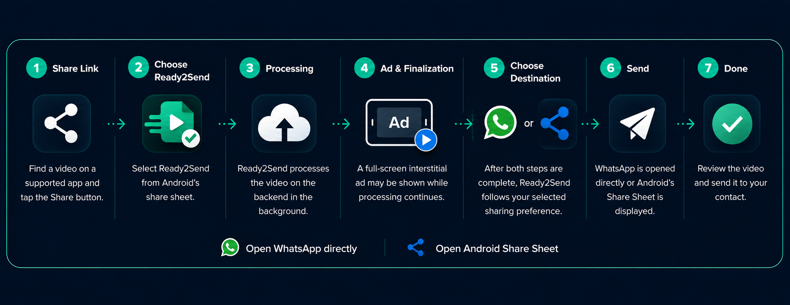

# Ready2Send

> Get your videos ready to share.

Ready2Send is an Android application designed to simplify the process of sharing supported online videos through WhatsApp or other supported sharing applications.

Instead of manually downloading and preparing a video for sharing, users can share a supported video link directly with Ready2Send. The application sends the link to its backend, where the video is downloaded, processed, validated, and returned as a shareable MP4.

## ✨ Features

- Share supported video links directly from Android's share menu
- Automatic video downloading and preparation
- Video conversion to MP4
- 95 MB maximum video size
- Pre-download size checking when supported by the source
- Post-download video size validation
- Automatic temporary-file cleanup
- Direct handoff to WhatsApp
- Android Share Sheet option for choosing another destination
- Full-screen interstitial advertising
- Supported platform detection
- Friendly handling of downloader and processing errors
- Clean dark-themed interface
- Settings and app information
- Privacy Policy and Terms of Use
- Premium section prepared for future subscription development

## 📱 How It Works

Ready2Send follows a simple three-step workflow:

### 1. Share

Share a video link from a supported application with Ready2Send.

### 2. Prepare

Ready2Send sends the link to its backend, where the video is downloaded, processed, validated, and prepared as an MP4.

### 3. Send

Once processing is complete, Ready2Send either opens WhatsApp directly or displays Android's Share Sheet, depending on the user's selected preference.

## 🏗️ How Ready2Send Works

From the user's perspective, Ready2Send keeps the process simple:

<p align="center">
  
</p>

1. **Share Link** — Find a video on a supported app and tap the Share button.
2. **Choose Ready2Send** — Select Ready2Send from Android's share sheet.
3. **Processing** — Ready2Send sends the link to the backend and prepares the video.
4. **Ad & Finalization** — A full-screen interstitial advertisement may be displayed while video processing continues.
5. **Choose Destination** — Once both processing and the advertisement stage are complete, Ready2Send follows the user's selected sharing preference.
6. **Send** — WhatsApp is opened directly or Android's Share Sheet is displayed.
7. **Done** — The user can review the prepared video and send it.

### Backend Flow

```text
Video URL
   ↓
FastAPI backend
   ↓
Platform downloader
   ├── parth-dl
   └── yt-dlp
   ↓
Pre-download size check (when available)
   ↓
Download
   ↓
Video validation
   ↓
Actual file-size check
   ↓
Temporary-file cleanup
   ↓
MP4 returned to Android client
```

Videos exceeding the current **95 MB limit** are rejected rather than compressed.

## 🛠️ Tech Stack

### Android

- Java
- XML
- Android Studio
- Android Intents
- FileProvider
- SharedPreferences
- Google Mobile Ads SDK

### Backend

- Python
- FastAPI
- yt-dlp
- parth-dl
- FFmpeg / FFprobe
- REST API architecture
- Temporary file handling
- Video validation
- 95 MB size validation

### Development

- Git & GitHub
- HTTP communication
- Physical Android device testing

## 📸 Screenshots

Here is the current Ready2Send experience.

### 1. Share from a supported app

Ready2Send appears directly in Android's share sheet. Select Ready2Send after finding a video you want to prepare for sharing.

<p align="center">
  
</p>

### 2. Processing the video

After receiving the shared link, Ready2Send starts preparing the video through the backend.

<p align="center">
  
</p>

### 3. Sending to WhatsApp

When WhatsApp mode is selected, Ready2Send hands the prepared video over to WhatsApp after processing and the ad stage are complete.

<p align="center">
  
</p>

### 4. Main screen

The main screen provides the central Ready2Send workflow and shows the supported platforms.

<p align="center">
  
</p>

### 5. Settings

The Settings screen allows the user to choose whether Ready2Send should automatically open WhatsApp or display Android's Share Sheet after processing.

<p align="center">
  
</p>

### 6. Premium

The premium section is prepared for future subscription features and an ad-free experience.

<p align="center">
  
</p>

### 7. Interstitial advertisement

A full-screen interstitial advertisement may appear while the backend continues processing the video.

<p align="center">
  
</p>

### 8. Opening the Share Sheet

When Share Sheet mode is selected, Ready2Send displays a short finalization message before opening Android's sharing interface.

<p align="center">
  
</p>

### 9. Share Sheet

The prepared MP4 is passed to Android's Share Sheet, allowing the user to select the destination.

<p align="center">
  
</p>

## 🚀 Project Status

Ready2Send is currently under active development.

The Android application and backend processing pipeline are functional as an MVP. The current local build supports video processing, 95 MB size validation, WhatsApp or Android Share Sheet delivery, and full-screen interstitial advertising.

Production deployment, backend hardening, and premium subscription functionality remain under development.

## 🔮 Planned Improvements

- Production backend deployment
- HTTPS and domain configuration
- API security and production hardening
- Improved download reliability
- Production monitoring and logging
- Additional supported platforms
- User authentication
- Usage limits and account management
- Google Play subscription functionality
- Premium ad-free experience
- Improved retry mechanisms

## 🔐 Privacy & Legal

Ready2Send includes an in-app Privacy Policy and Terms of Use.

The application is designed around processing user-provided video links and does not require users to provide social-media account credentials.

Temporary video files are used during backend processing and are removed after processing is complete.

Users are responsible for ensuring that their use of the application complies with the terms and policies of the platforms and content they access.

The Privacy Policy and Terms of Use included in the application should be treated as the project's governing legal documents.

## 👨‍💻 About the Project

Ready2Send is an independent software project developed as part of my journey toward becoming a backend developer.

The project provides hands-on experience building a complete client-server application, including an Android client, REST API, server-side video downloading and processing, external tool integration, file handling, error handling, cloud infrastructure, and deployment.

The long-term goal is to continue improving the backend architecture and eventually transition the backend into a Java/Spring Boot-based production system.

## 📄 License

This project is currently intended primarily as a learning and portfolio project.
